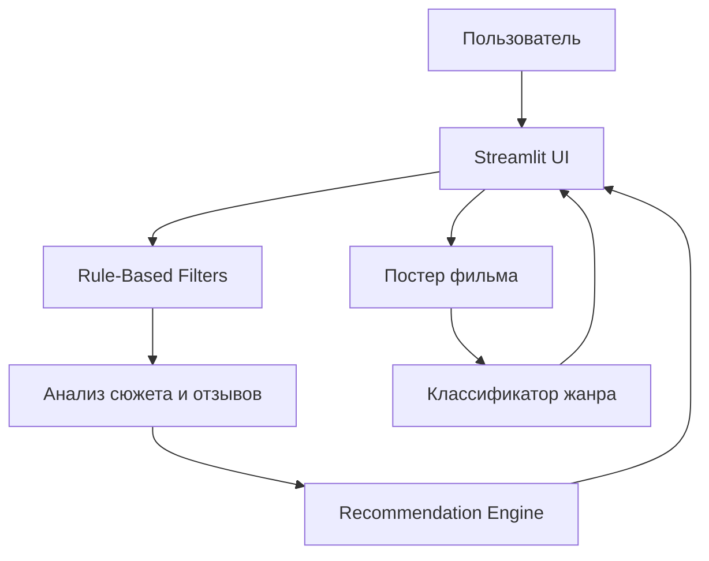

# (˶˃ ᵕ ˂˶) .ᐟ.ᐟ Кино и Книги — Советчик

## 📖 О проекте

**Кино и Книги — Советчик** — это интерактивное веб-приложение, которое помогает пользователям находить фильмы и книги, похожие на те, что им уже нравятся.

Приложение сочетает:

* 🔹 Фильтры по году и жанру
* 🔹 Анализ сюжета и отзывов (NLP)
* 🔹 Определение жанра по постеру (Компьютерное зрение)
* 🔹 Поиск похожих фильмов через векторные представления (эмбеддинги)

**Пример взаимодействия:**

> "Мне нравится Матрица" → Советует "Начало"

Проект разрабатывается совместно и хранится на **GitHub**.

---

## 🎯 Цели проекта

* Рекомендовать фильмы и книги с похожим сюжетом и тематикой
* Фильтровать контент по году выпуска и жанру
* Определять жанр фильма по постеру (Драма / Ужасы)
* Продемонстрировать практическое использование ML и AI технологий

---

## 🏗 Архитектура проекта



---

## 📂 Структура проекта

```
my_project/
├── README.md
├── requirements.txt
├── src/
│   ├── main.py
│   └── __init__.py
├── data/
│   ├── raw/
│   └── processed/
├── notebooks/
└── docs/
```

> Примечание: папка `data/` добавлена в `.gitignore` — датасеты загружаются локально.

---

## 👥 Команда

* **Исабек Тина** — разработка проекта
* **Хасенова Инкара** — разработка проекта

---

## 🚧 Статус

Проект находится на стадии **активной разработки**.
README будет дополняться по мере появления файлов, датасетов и новых функций.

---

## ⚡ Как запустить (позже)

```bash
pip install -r requirements.txt
streamlit run src/main.py
```

---

## 📝 Примечания

* Датасеты не хранятся в репозитории из-за их размера.
* Все эксперименты проводятся локально.


⠀⠀⠀⠀⠀⠀⠀⠀⠀⡀⠀⠀⠀⠀⠀⠀⠀⠀⠀⠀⠀⠀⠀⢠⡀⠀⠀⠀⠀⠀⠀⠀⠀
⠀⠀⠀⠀⠀⠀⠀⠀⣼⣿⣆⠀⠀⠀⠀⠀⠀⠀⠀⠀⠀⠀⣴⢿⣧⠀⠀⠀⠀⠀⠀⠀⠀
⠀⠀⠀⠀⠀⠀⠀⢠⣿⠉⢻⣦⠀⠀⠀⠀⠀⠀⠀⠀⢀⣴⠏⠈⣿⣆⠀⠀⠀⠀⠀⠀⠀
⠀⠀⠀⠀⠀⠀⢀⣿⠃⠀⠀⠹⣷⡄⠀⠀⠀⠀⠀⣠⡾⠇⠀⠀⠘⣿⡆⠀⠀⠀⠀⠀⠀
⠀⠀⠀⠀⠀⠀⣾⠃⠀⠀⠄⠈⠌⢿⣦⣤⣤⣤⣴⠟⠡⠀⠀⠠⠀⠘⣿⡄⠀⠀⠀⠀⠀
⠀⠀⠀⠀⠀⣸⡟⠀⠀⢂⠄⠊⠀⠀⠉⠁⠀⠈⠉⠀⠀⠐⠠⡀⠀⠀⠹⣷⡀⠀⠀⠀⠀
⠀⠀⠀⠀⢰⡿⠀⠀⠈⠀⠀⠀⠀⠀⠀⠀⠀⠀⠀⠀⠀⠀⠀⠀⠑⠀⠀⢻⣧⠀⠀⠀⠀
⠀⠀⠀⢀⡿⠁⠀⠀⠀⠀⠀⠀⠀⠀⠀⠀⠀⠀⠀⠀⠀⠀⠀⠀⠀⠀⠀⠀⢻⡆⠀⠀⠀
⠀⢀⣀⣼⣷⣤⣤⣤⣤⣤⣤⣤⣤⣄⣀⣀⣀⠀⢀⣀⣀⣠⣤⣤⣤⣤⣤⣤⣼⣧⡀⠀⠀
⣴⣿⠟⠉⠁⢠⣾⣿⣯⠙⠛⠛⠉⠙⠻⣿⡿⠿⢿⣿⣿⠟⠛⠉⣿⣿⣿⡟⠛⠛⢿⣿⡄
⣿⣿⡄⠀⠀⠸⣿⣿⡿⠁⠀⠀⠀⠀⣠⣿⠁⠀⠀⠹⣿⣄⠀⠀⢿⣿⣿⠟⠀⠀⠀⣿⠇
⠈⠻⣿⣷⣶⣤⣤⣤⣤⣤⣤⣤⣴⡾⠿⠃⠀⠀⠀⠀⠈⠻⠿⢶⣶⣾⣧⣤⣤⡶⣿⠛⠀
⠀⠀⣿⠀⠉⠉⠉⠉⠉⠉⠀⠀⠀⠀⠀⠀⠀⠀⠀⠠⠦⡄⠀⠀⠀⠀⠀⠀⠈⠀⢻⡆⠀
⠀⠀⣿⠀⠁⠀⠀⠀⠀⠂⠀⠀⣾⣁⣤⢷⣄⣀⣀⣀⡴⠃⠀⠀⠀⠀⠀⠀⠈⠀⢸⡇⠀
⠀⠀⢿⡄⠀⠀⠀⠀⠀⠀⠀⠀⠉⠉⠉⠈⠉⠛⠛⠋⠁⠀⠀⠀⠀⠀⠀⠀⠀⢠⣾⠃⠀
⠀⠀⠈⠛⠷⣶⣤⣀⣀⣀⣀⡀⠀⠀⠀⠀⠀⠀⠀⠀⠀⣀⣀⣀⣀⣠⣤⣶⠶⠟⠁⠀⠀
⠀⠀⠀⠀⠀⠀⠈⠉⠉⠉⠙⠛⠛⠛⠛⠛⠛⠛⠛⠛⠛⠛⠋⠉⠉⠉⠁⠀⠀⠀⠀⠀⠀
